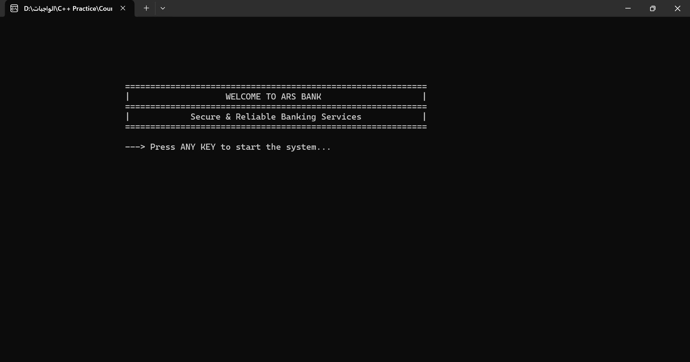
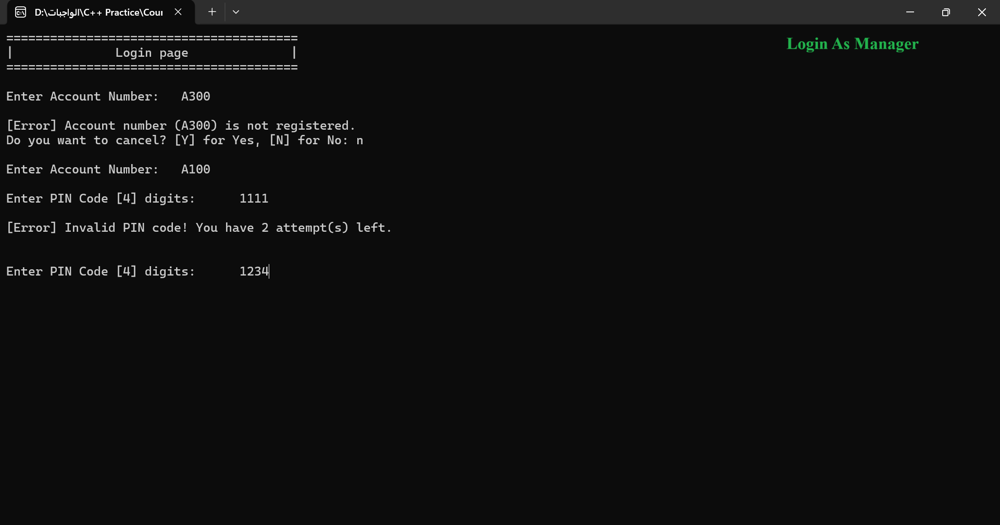
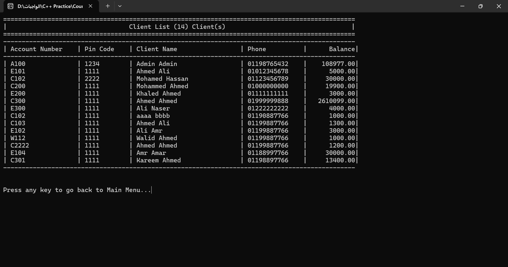
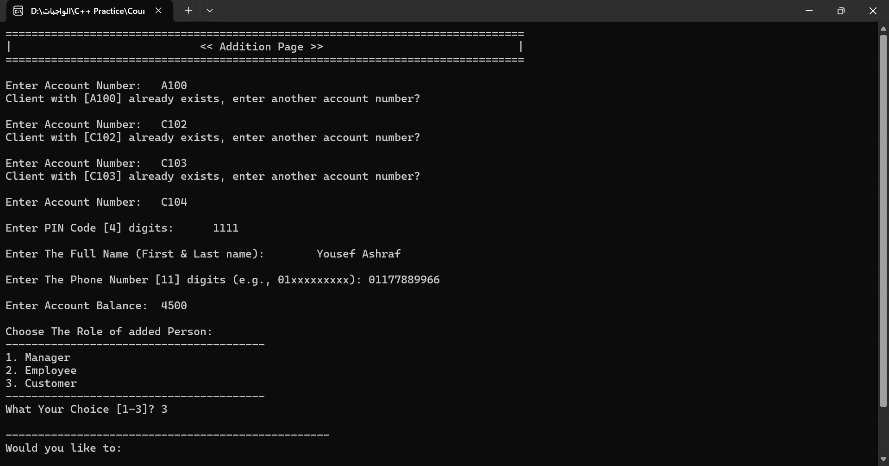
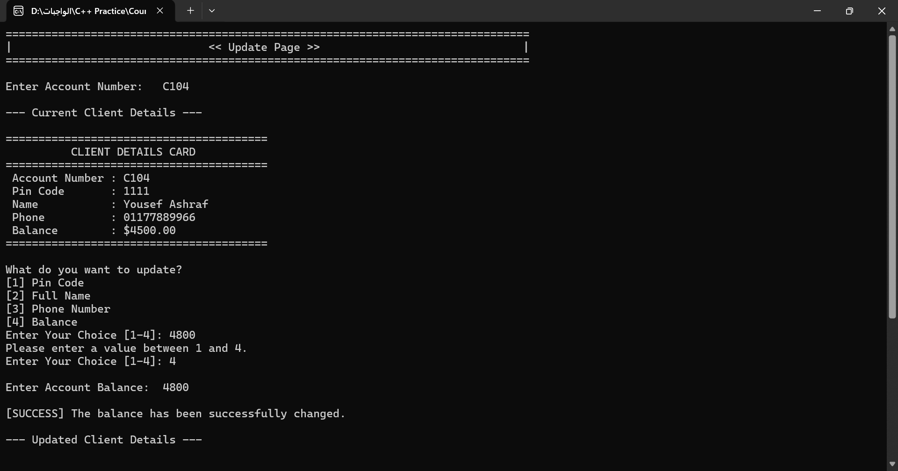
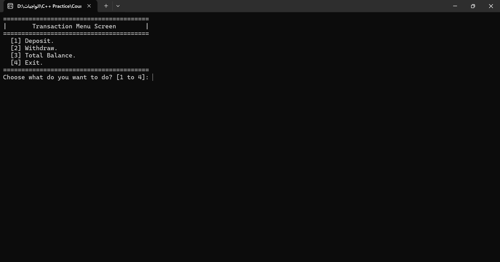
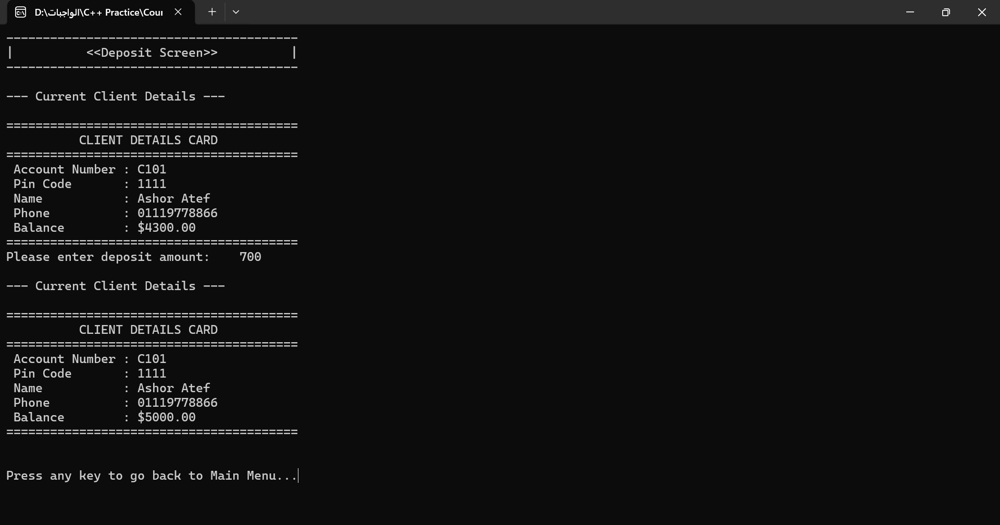

# ARS Bank Management System

A console-based Bank Management System built with **C++**.

The project simulates basic banking operations with a focus on **client management, role-based access control, authentication, input validation, file handling, and data persistence**.

---

## 📌 Project Overview

ARS Bank Management System is a C++ console application designed to simulate a simple banking environment.

The system supports three different user roles, with different permissions and available operations depending on the logged-in user's role.

### 👤 User Roles

#### Manager
- View all clients
- Add new clients
- Delete clients
- Update client information
- Search for clients
- Manage client balances
- Perform banking transactions

#### Employee
- Add new clients
- Update permitted client information
- Search for clients
- Perform banking transactions

#### Customer
- View account balance
- Deposit money
- Withdraw money

---

## ✨ Features

### 🔐 Authentication & Access Control

- Account number and PIN authentication
- Maximum of 3 PIN attempts
- Role-based access control
- Different permissions for Manager, Employee, and Customer

### 👥 Client Management

- Add new clients
- Delete clients
- Update client information
- Search for clients
- Display all clients
- Prevent duplicate account numbers

### 💰 Banking Transactions

- Deposit money
- Withdraw money
- Check total balance
- Prevent invalid withdrawals
- Prevent negative balances

### 💾 Data Persistence

Client data is stored locally in a text file:

```text
Clients.txt
```

The system loads client data when the application starts and saves changes back to the file.

### ✅ Input Validation

The system validates:

- Account numbers
- PIN codes
- Full names
- Phone numbers
- Account balances
- Deposit amounts
- Withdrawal amounts
- Menu choices

---

## 🛠️ Technologies Used

- **C++**
- Object-oriented programming concepts
- STL (`vector`, `string`, `algorithm`)
- File handling (`fstream`)
- Enumerations
- Iterators
- Input validation
- Console-based UI

---

## 📂 Project Structure

```text
ARS-Bank-Management-System/
│
├── ARS-Bank-Management-System.cpp
├── Clients.txt
├── Screenshots/
│   ├── welcome-screen.png
│   ├── login-screen.png
│   ├── manager-menu.png
│   ├── client-list.png
│   ├── transaction-menu.png
│   └── update-client.png
│
└── README.md
```

---

## 🖥️ Screenshots

### Welcome Screen



### Login & Authentication



### Client List



### Add Client



### Update Client



### Banking Transactions



### Deposit Operation



---

## ▶️ How to Run

1. Clone the repository:

```bash
git clone https://github.com/YOUR-USERNAME/ARS-Bank-Management-System.git
```

2. Open the project in a C++ IDE such as:

- Visual Studio
- Code::Blocks
- Dev-C++
- VS Code with a C++ compiler

3. Compile the source code.

4. Run the application.

5. Make sure `Clients.txt` is located in the application's working directory.

---

## 🔑 Sample Login

You can use the following sample account:

```text
Account Number: A100
PIN Code: 1234
Role: Manager
```

---

## 📚 What I Practiced

Through this project, I practiced:

- Designing a console-based application
- Working with structures and enumerations
- Using STL containers and iterators
- Reading and writing data using files
- Implementing authentication
- Applying role-based permissions
- Building reusable functions
- Validating user input
- Managing application state
- Handling unsaved changes
- Structuring a larger C++ project

---

## 🚀 Future Improvements

Possible future improvements include:

- Password/PIN encryption
- Transaction history
- Multiple accounts per customer
- Database integration
- Better security mechanisms
- GUI interface
- Automated testing
- More advanced permission management

---

## 👨‍💻 Author

**Amr Rabie**

Computer Science Student | C++ Developer | Data Analysis Enthusiast

---

⭐ If you find this project useful, feel free to explore the repository.
